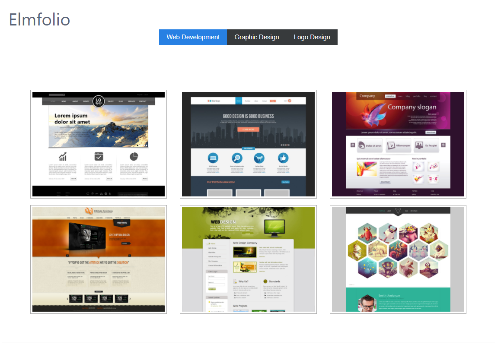

Back to [Part 6](../part6/README.md)

# Introduction to Elm (Part 7)

>Before getting started with this part, be sure to `cd` into the directory `part7` in your project and open the `Main.elm` file

In this section, we'll be updating our `view` function to display the data returned by the API in a meaningful
way. 

>A note before we start. Instead of using HTML tags like `<a>`, `<div>`, `<i>` etc. we use functions in Elm to produce these
same outputs on the screen. Almost all of these functions have the same type signature to make them easily
composable. For instance, here's the type definition of the `h1` function which, in turn produces an `<h1>` HTML tag:

```elm
h1 : List (Attribute msg) -> List (Html msg) -> Html msg
```

Calling this in practice would look like:

```elm
h1 [ ... attributes here... ] [ ..child tags here...]
```
 
As with tags, HTML attributes are also simply functions like `class`, `style` etc. Some of the implementations of these vary
depending on what the value of the attribute will look like but as with most Elm things, it will generally 
be standardized as much as possible to avoid confusion `h1 [ attributeOne argument, attributeTwo argument, ...]`

So with that, let's start updating our `view` function. Let's remove the code we currently have
in the function `text (toString model)` and replace it with the following view code, then save the file:

```elm
view : Model -> Html Msg
view model =
    let
        portfolio =
            model.portfolio

        selectedCategoryId =
            getSelectedCategoryId model

        selectedItem =
            getSelectedItem model selectedCategoryId
    in
    div [ class "container" ]
        [ div [ class "row" ]
            [ div
                [ class "col"
                ]
                [ br [] [] ]
            ]
        , div [ class "row" ]
            [ div
                [ class "col"
                ]
                [ h1 [] [ text "Elmfolio" ] ]
            ]
        , viewCategoryNavbar portfolio selectedCategoryId
        , viewSelectedItem selectedItem
        , viewItems model selectedCategoryId selectedItem
        ]
```

>Notice we've added some of the `view` helpers code to the file as these don't add much in the way of teaching concepts, however, 
it's likely valuable to analyse these once the workshop is completed and you have a working Elm app. If you have any questions
about how these functions work, or what they are doing, feel free to ask your instructors during the wrap up time. 

Another note here is that we're introducing the `let...in` expression which allows you to build up intermediary results in
the `let` portion of the block and use them in the `in` portion. These variables remain local to the `let...in...` scope
so they cannot be accessed elsewhere.

Next, we need to add a couple of extra fields to our `Model` to hold our app's state.

Let's update the definition of `Model` from

```elm
type alias Model =
    { errorMessage : String
    , portfolio : Portfolio
    , apiUrl : String
    }
```

to

```elm
type alias Model =
    { errorMessage : String
    , portfolio : Portfolio
    , selectedCategoryId : Maybe Int
    , selectedItemId : Maybe Int
    , apiUrl : String
    }
```

Here we're adding the following fields:

- `selectedCategoryId : Maybe Int` which will be updated as the user clicks on the different categories, we're using a
`Maybe Int` here because upon initialization, no value will be selected and we need to handle that case (we'll see how
shortly).

- `selectedItemId : Maybe Int` which is similar to `selectedCategoryId` in that it tracks which `Item` the user has
 selected and uses a `Maybe Int` (for the same reason given above).

As we've done before when we updated the `Model` definition, we need to also update our `initialModel` function. 
Let's replace our `initialModel` definition with the following:
 
```elm
initialModel : String -> Model
initialModel url =
    { errorMessage = ""
    , portfolio =
        { categories = []
        , items = []
        }
    , selectedCategoryId = Nothing
    , selectedItemId = Nothing
    , apiUrl = url
    }
```

>Notice we just added the two new fields and initialized them both to `Nothing` to show that we do not have a value
until the user actually clicks on a `Category` and/or `Item` in the UI

We've automatically added two new helper functions `getSelectedCategoryId` and `getSelectedItem` to determine the states of our selected
`Category` and selected `Item`. Time permitting, we'll review these once we complete the app and have it running. 

Okay, so now we should be able to run `elm-live Main.elm --output=static/js/elm.js --pushstate --open --debug`
in a terminal and start seeing the fruits of our all of our hard work. You should see something similar
to the screenshot below upon the app being opened in a browser:



#### Recap

In this section, we updated our `view` function to display the data returned by the API in a meaningful
way. 

Currently, we have no real way to _interact_ with the app, in the next section, we'll wire up some new 
messages to be called when a user:

- Clicks on a Category button
- Clicks on any one of the images within a category

This will involve updating both our union type for `Msg` as well as adding new cases to our `update` function

Go to [Part 8](../part8/README.md)